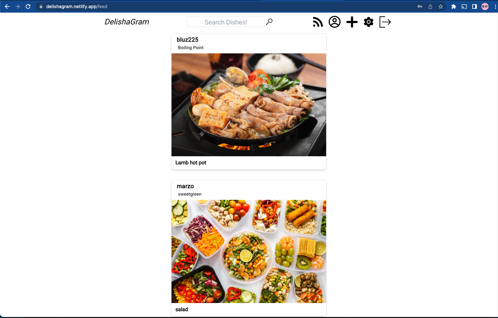

# DelishaGram
### Phone Eats First
Introduction/Description:
Have you ever been scrolling through your Instagram and thought, "Why is my feed full of wack influencers? Where's the food?" Well you'll be downright giddy to hear that the fellas over at Team Codeplay have developed the perfect app to satisfy all your foodie needs. Upon login you'll be directed to a home page that shows a random post from a user with a link that navigates to a page that shows your own posts and a link that allows you to make a new post, as well as one to edit a post. Additionally there will be a search function that allows you to search by dish to see all the posts associated with that dish. Finally, we will also provide the ability to make edits to your account information. With all of this said and done, have a blast navigating through this plethora of food porn. And don't forget, Phone Eats First!

- [See the deployed site here!](https://delishagram.netlify.app/)
- [Client Git Repo](https://github.com/j-onederful/DelishaGram-client)
- [Server Git Repo](https://github.com/j-onederful/DelishaGram-server)

## Team Members:
- Jack Wyman
- Billy Lu
- Wonjune Jung

## Installation Instructions to Local
1. clone the server repo and client repo into seperate folders
2. within the server folder
    - npm i OR npm install in relevant directory
    - create .env file and add the following variables:
        - JWT_SECRET=
        - CLOUDINARY_URL=
        - YELP_API_KEY=
    - enter whatever string you would like into JWT_Secret
    - get a Cloudinary API key and set it accordingly in the .env file
    - get a Yelp API key and set it accordingly in the .env file
3. within the client folder
    - npm i OR npm install in relevant directory
    - create .env.local file and add the following variables:
        - REACT_APP_SERVER_URL=http://localhost:8000

## Start Up Instructions (AFTER INSTALLATION)
1. start up the server in VS code
2. type "nodemon" in the terminal without the ""
3. start up the client in a SECOND VS code
4. type "npm start" without the ""
5. Happy Exploring

## Challenges Encountered and lessons learned
1. implmenting the cloudinary image upload functionality
2. implementing geolocation using the web3 API
3. 

## Bugs
- the unfollow button rerenders twice which causes it to look jittery
- the search bar is a specifc search instead of includes
- the userName is not held in state for the whole app and if changed will cause profile page to break until the next re-render
- register does not compare email AND username, also there is no message to show that the username is already taken

## Features that werent implemented
- uploading profile pictures
- one click functionality to upload an image, currently requires file to be chosen and then submitted
- responsiveness

## Planning
Miro Board was used for planning
https://miro.com/app/board/uXjVOqx-LQA=/?share_link_id=487280606838

## Technologies used
- Yelp API
- Cloudinary API
- multer
- bcrypt
- jwt-decode
- MongoDB
- dot-env
- jsonwebtoken
- Express
- React
- react-router-dom
- React-Modal
- React-Icons
- NodeJS
- Mongoose
- Axios
- Cors
- nodemon
- tailwind

## User Stories
- As a unregistered user, I would like to sign up or log in
- As a registered user, I would like to sign in with username and password.
- As a signed in user, I would like to sign out.
- As a signed in user, I would like to add a post to my wall
- As a signed in user, I would like to update a post on my wall
- As a signed in user, I would like to delete a post on my wall
- As a signed in user, I would like to see all my posts
- As a signed in user, I would like to view a list of other users and view their walls
- As a signed in user, I would like to "like/favorite" other use's posts

## Wire Frames

## ERD

## Planned RESTful Routes
| VERB | URL pattern | Action \(CRUD\) | Description |
| :--- | :--- | :--- | :--- |
| GET | /users/login|\(Read\) | Show login page |
| POST | /users/login|\(Read\) | Check authentication and authorize |
| GET | /users/register |\(READ\) | Show Sign Up Page |
| POST | /users/register |\(Create\) | Create User/authentication and authorization |
| PUT | /users/edit |\(Update\) | Route to Update profile Info in DB |
| PUT | /users/changepassword |\(Update\) | Route to Update Password in DB |
| GET | /users/logout |\(Read\) | logout |
| GET | /users/profile |\(Read\) | Shows users profile Page |
| PUT | /users/profile |\(UPDATE\) | Update user's profile |
| PUT | /users/changepassword |\(UPDATE\) | Change user's password |
| GET | /post |\(Read\) | Show all of user's posts|
| POST | /posts |\(Create\) | Create a post about a dish |
| GET | /posts/:id |\(READ\) | Show details about a dish post|
| PUT | /post/:id |\(UPDATE\) | Edit selected post|
| DELETE | /post/:id |\(DELETE\) | Delete the post |
| GET | /posts/search/:dishname |\(Read\) | show search results |

## MVP Requirements
- Create Sign-Up, Login pages
- Create New Post page and Edit Post page for user posts
- Create page that shows all of user's posts 
- Create Edit User Info page
- Allow user to search for dishes and show dishes results page

## Stretch Goals
- Allow user to search by restaurant and by user in addition to being able to search by dish
- Create page that shows all results for a certain restaurant
- Create page that shows all results for a certain user
- Allow user to favorite dishes and create page that shows all the dishes a user has favorited
- Upload an image
- Show that image when a dish is rendered
